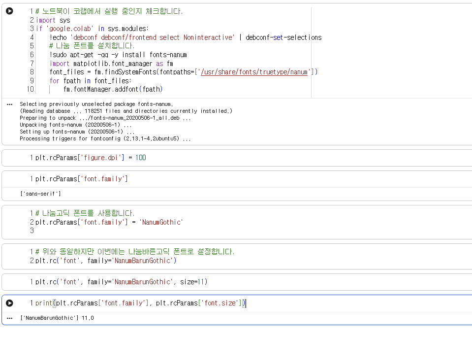
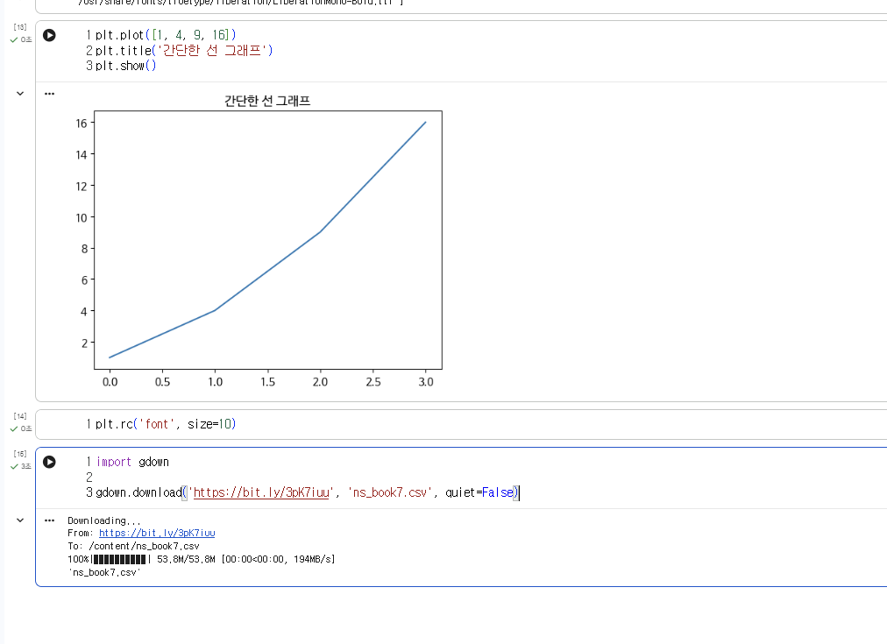
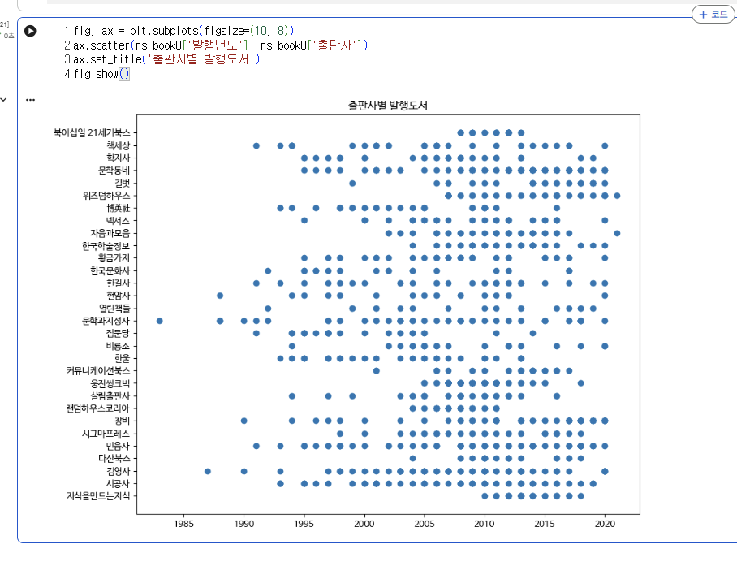
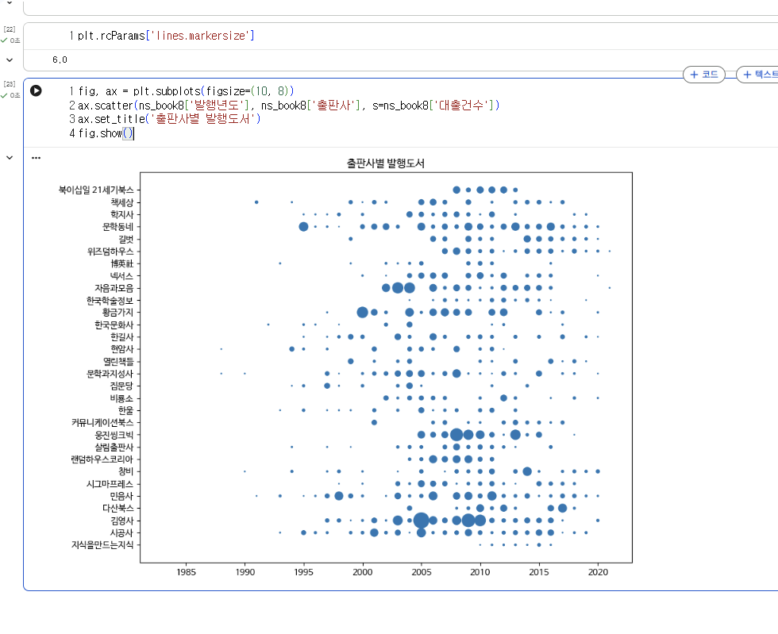
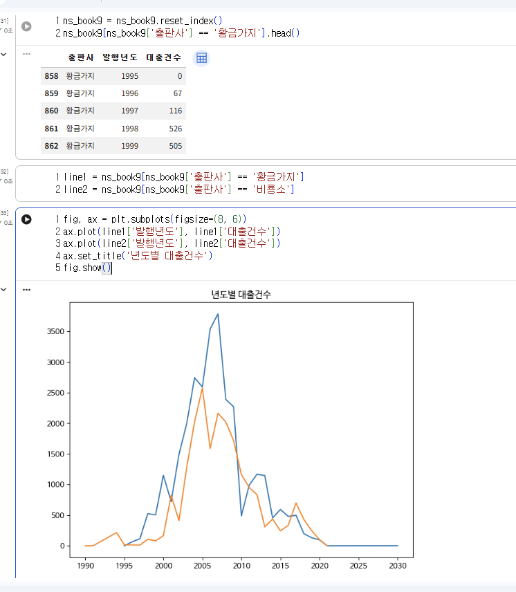
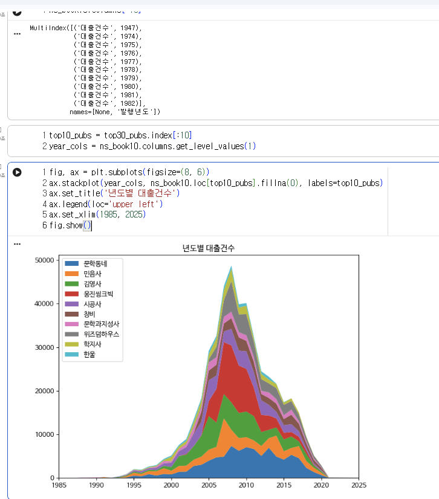

# 데이터분석 6주차 정규과제

📌데이터분석 정규과제는 매주 정해진 분량의 『*혼자 공부하는 데이터 분석 with 파이썬*』 을 읽고 학습하는 것입니다. 이번 주는 아래의 **DataAnalysis_6th_TIL**에 나열된 분량을 읽고 공부하시면 됩니다.

아래의 문제를 풀어보며 학습 내용을 점검하세요. 문제를 해결하는 과정에서 개념을 스스로 정리하고, 필요한 경우 제시된 강의를 참고하여 보완하는 것이 좋습니다.

<!-- 강의 링크는 아래와 같습니다.
https://www.youtube.com/watch?v=XD65UhBMOiI&list=PLVsNizTWUw7FGzSRCkQrPEEe-ljVXgS7k&index=12
https://www.youtube.com/watch?v=NTQ5NXelOfw&list=PLVsNizTWUw7FGzSRCkQrPEEe-ljVXgS7k&index=13
-->


## DataAnalysis_6th_TIL

### 6장 복잡한 데이터 표현하기
#### 01. 객체지향 API로 그래프 꾸미기
#### 02. 맷플롯립의 고급 기능 배우기


## Study Schedule

| 주차  | 공부 범위     | 완료 여부 |
| ----- | ------------- | --------- |
| 1주차 | p.24~81    | ✅         |
| 2주차 | p.84~151   | ✅         |
| 3주차 | p.154~219  | ✅         |
| 4주차 | p.222~279 | ✅         |
| 5주차 | p.282~325 | ✅         |
| 6주차 | p.328~379 | ✅         |
| 7주차 | p.382~430 | 🍽️         |

<br>

<!-- 여기까진 그대로 둬 주세요-->


# 1️⃣ 개념 정리 

## 01. 객체지향 API로 그래프 꾸미기

<!-- 새롭게 배운 내용을 자유롭게 정리해주세요.-->

1. 객체지향 API 방식
기존의 간단한 방식과 달리 도화지와 그래프 영역을 나타내는 객체를 직접 만들고 다루는 방법이다. 전용 메서드를 사용하기 때문에 복잡한 그래프를 여러 개 그릴 때 훨씬 정교하고 자유롭게 제어할 수 있다.

2. 한글 폰트 설정
맷플롯립 기본 상태에서는 한글이 깨져서 나오기 때문에 한글 폰트를 따로 설치하고 설정해 주는 과정이 필수다.

3. 산점도 마커 다채롭게 꾸미기
단순히 점만 찍는 것을 넘어 데이터의 실제 값에 비례하여 마커의 크기를 각각 다르게 설정할 수 있다. 투명도, 테두리 색상, 테두리 선 두께, 마커 내부 색상까지 세밀하게 조절하면 여러 정보를 하나의 그래프에 풍부하게 담아낼 수 있다.

4. 컬러맵과 컬러 막대
값의 크기에 따라 색상이 자연스럽게 변하도록 컬러맵을 적용할 수 있다. 그래프 옆에 컬러 막대를 추가하면 각 색상이 어떤 수치를 의미하는지 보는 사람이 쉽게 파악할 수 있다.

## 02. 맷플롯립의 고급 기능 배우기

<!-- 새롭게 배운 내용을 자유롭게 정리해주세요.-->

1. 고급 그래프 종류와 특징
스택 영역 그래프: 선 그래프 여러 개를 위로 차곡차곡 쌓아 올린 형태다. 선 아래의 면적에 색이 칠해져 있어서 전체적인 데이터의 덩치 흐름과 각 항목이 차지하는 비중을 한눈에 파악하기 좋다.

스택 막대 그래프: 막대 그래프를 옆으로 늘어놓지 않고 하나의 굵은 막대 위로 층층이 쌓아 올린 형태다. 막대 그리기 함수에서 다음 막대가 시작될 밑바닥 위치를 이전 막대의 높이로 지정해 주는 방식을 써서 수동으로 쌓아 올린다.

원 그래프: 전체 데이터 안에서 각 항목이 차지하는 비율을 피자 조각 같은 부채꼴로 보여준다. 기본적으로 3시 방향에서 시작해 반시계 방향으로 그려진다. 눈대중만으로는 조각의 크기를 정확히 비교하기 어렵다는 단점이 있어서, 보통 각 조각 안에 퍼센트 비율을 숫자로 명확하게 표시해 주는 옵션을 필수로 함께 쓴다.

2. 한 화면에 여러 그래프 그리기
선 그래프 겹치기: 그리기 함수를 여러 번 연속해서 호출하면 하나의 도화지에 여러 선이 자연스럽게 겹쳐서 그려진다.

막대 그래프 나란히 배치: 막대 그래프를 그냥 두 번 부르면 제자리에 겹쳐서 덮어씌워진다. 막대를 옆으로 나란히 배치하려면 막대의 두께를 반으로 줄이고, x축 위치를 서로 겹치지 않게 수학적으로 밀어서 그려주어야 한다.


# 2️⃣ 수행 인증









<br>
<br>

# 3️⃣ 확인 문제

## 문제 1.

> **🧚Q. 이번 주차에는 확인문제 대신 그래프 그리기 실습을 진행합니다.
4주차에서 사용했던 캐글 데이터셋을 활용하여, 다양한 요소를 포함한 복잡한 그래프를 직접 작성해주세요.**

```
https://colab.research.google.com/drive/1doZMWobPUH630F28QVijRtAp0iCTwOHZ?usp=sharing
```


### 🎉 수고하셨습니다.