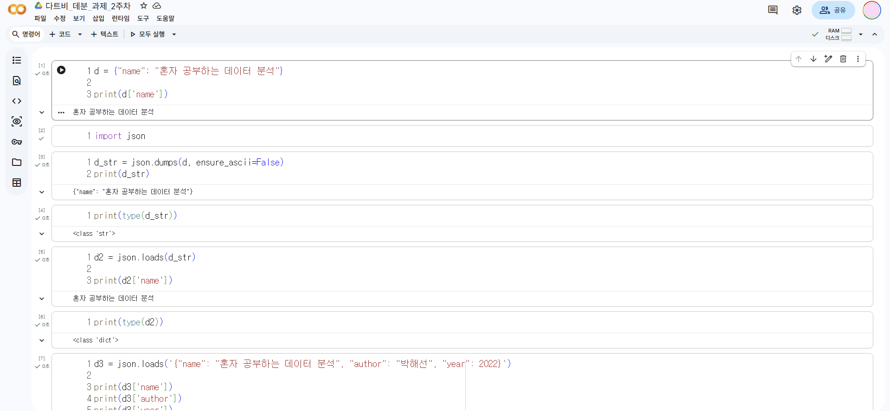
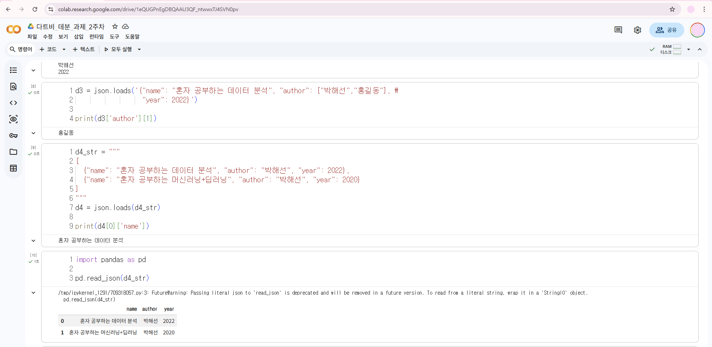
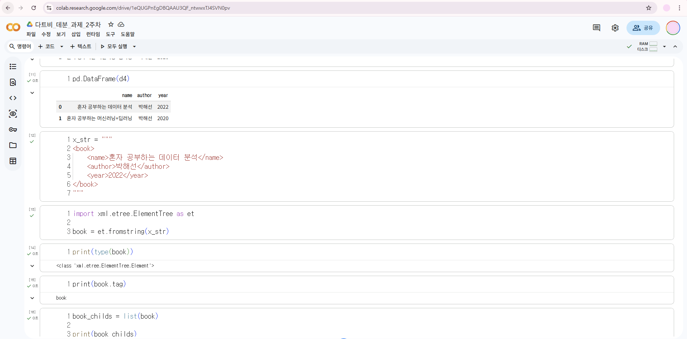
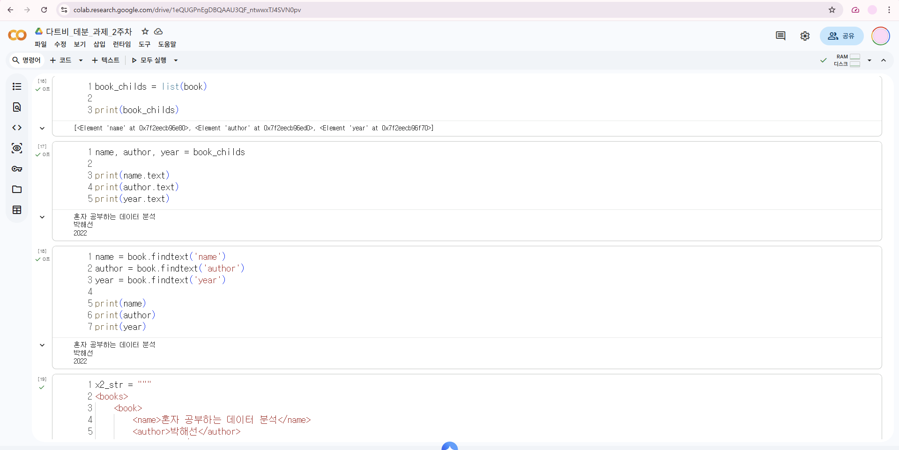
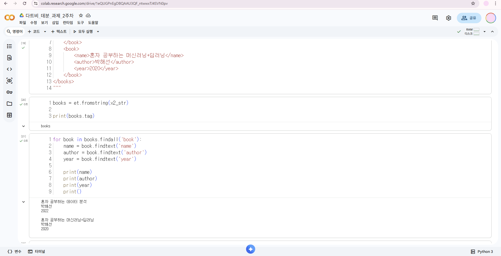

# 데이터분석 2주차 정규과제

📌데이터분석 정규과제는 매주 정해진 분량의 『*혼자 공부하는 데이터 분석 with 파이썬*』 을 읽고 학습하는 것입니다. 이번 주는 아래의 **DataAnalysis_2nd_TIL**에 나열된 분량을 읽고 공부하시면 됩니다.

아래의 문제를 풀어보며 학습 내용을 점검하세요. 문제를 해결하는 과정에서 개념을 스스로 정리하고, 필요한 경우 제시된 강의를 참고하여 보완하는 것이 좋습니다.

<!-- 강의 링크는 아래와 같습니다.
https://www.youtube.com/watch?v=s_-VvTLb3gs&list=PLVsNizTWUw7FGzSRCkQrPEEe-ljVXgS7k&index=4
https://www.youtube.com/watch?v=Il6L8OtNFpc&list=PLVsNizTWUw7FGzSRCkQrPEEe-ljVXgS7k&index=5
-->


## DataAnalysis_2nd_TIL

### 2장 데이터 수집하기
#### 01. API 사용하기
#### 02. 웹 스크래핑 사용하기


## Study Schedule

| 주차  | 공부 범위     | 완료 여부 |
| ----- | ------------- | --------- |
| 1주차 | p.24~81    | ✅         |
| 2주차 | p.84~151   | ✅         |
| 3주차 | p.154~219  | 🍽️         |
| 4주차 | p.222~279 | 🍽️         |
| 5주차 | p.282~325 | 🍽️         |
| 6주차 | p.328~379 | 🍽️         |
| 7주차 | p.382~430 | 🍽️         |

<br>

<!-- 여기까진 그대로 둬 주세요-->


# 1️⃣ 개념 정리 

## 01. API 사용하기

<!-- 새롭게 배운 내용을 자유롭게 정리해주세요.-->
API와 HTTP: API는 프로그램 간 데이터를 주고받는 규칙이며, 웹 통신에는 주로 HTTP 프로토콜이 사용된다.
GET 호출: 웹 API 요청 시 URL 뒤에 ?와 &로 연결된 쿼리 스트링을 통해 파라미터와 인증키를 전달한다.
JSON 특징: 파이썬의 딕셔너리 구조와 매우 유사한 '키(Key)-값(Value)' 쌍의 가볍고 범용적인 데이터 포맷이다.
JSON 다루기: json.loads()로 파이썬 객체로 변환하거나, pd.read_json()으로 손쉽게 판다스 데이터프레임으로 만든다.
XML 특징: 데이터를 시작 태그와 종료 태그로 감싸며, 부모-자식 노드의 계층적 구조로 상세하게 표현하는 포맷이다. 파이썬 내장 패키지인 xml.etree.ElementTree의 fromstring()을 사용해 XML 문자열을 파이썬 객체로 바꾼다. findtext(), findall() 등의 메서드를 활용하면 복잡한 구조 속에서도 원하는 태그의 데이터를 안전하게 추출할 수 있다.
데이터 수집 요약: 결과적으로 API를 통해 제공받은 복잡한 JSON이나 XML 텍스트를 파이썬과 판다스로 파싱하여 분석 가능한 표(데이터프레임) 형태로 수집하는 것이 핵심이다.

## 02.웹 스크래핑 사용하기

<!-- 새롭게 배운 내용을 자유롭게 정리해주세요.-->
웹 스크래핑: 웹사이트를 구성하는 HTML 문서에서 프로그램으로 필요한 데이터만 골라내어 추출하는 기술이다.
BeautifulSoup: requests 패키지로 가져온 복잡한 HTML 문서를 다루기 쉽게 파싱해 주는 대표적인 파이썬 라이브러리이다.
태그 탐색과 추출: find(), find_all()로 조건에 맞는 태그를 찾고, get_text()를 사용해 태그 기호를 제외한 순수 텍스트만 뽑아낼 수 있다.

데이터프레임의 apply() 메서드를 쓰면, 반복문 없이도 여러 행에 사용자 정의 스크래핑 함수를 효율적으로 적용할 수 있다.
데이터 병합(merge): 수집된 새로운 결과물(시리즈)에 이름을 지정한 뒤 기존 데이터프레임과 합쳐 하나의 온전한 표로 완성한다.

스크래핑을 할 시 주의점 : 
- 서버에 과부하를 줄 수 있으므로, 해당 웹사이트의 robots.txt 파일을 확인하여 데이터 수집이 허용된 구역인지 파악해야 한다.
- 웹페이지의 HTML 구조는 자주 바뀔 수 있어 유지보수가 까다로우며, 자바스크립트로 동적 렌더링되는 페이지는 기본 도구로 수집하기 어렵다.


# 2️⃣ 수행 인증

<!-- 교재에서 안내된 과정을 직접 실행해본 뒤, 진행 결과가 보이도록 4~6장의 스크린샷을 캡처하여 아래에 첨부해주세요.-->











<br>
<br>

# 3️⃣ 확인 문제

## 문제 1.

> **🧚Q. 다음 중 BeautifulSoup 외에 웹 스크래핑에 사용할 수 있는 파이썬 패키지로 가장 적절한 것은 무엇인가요?**

```
1️⃣ NumPy  
2️⃣ Scrapy  
3️⃣ Matplotlib  
4️⃣ Scikit-learn  
```

```
Scrapy이다. 이 패키지는 requests와 뷰티풀수프를 합쳐 놓은 것과 비슷합니다. 그러나 이 패키지는 코랩에 설치되어 있지는 않다. 따라서 이를 사용하려면 스크래피 공식 홈페이지를 참고해야 한다.
```


### 🎉 수고하셨습니다.