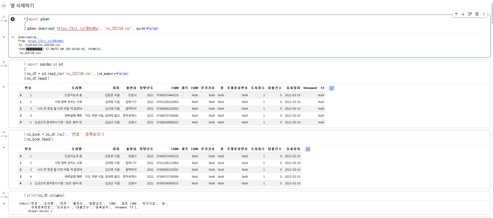
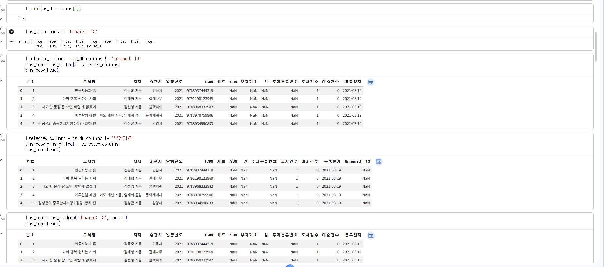
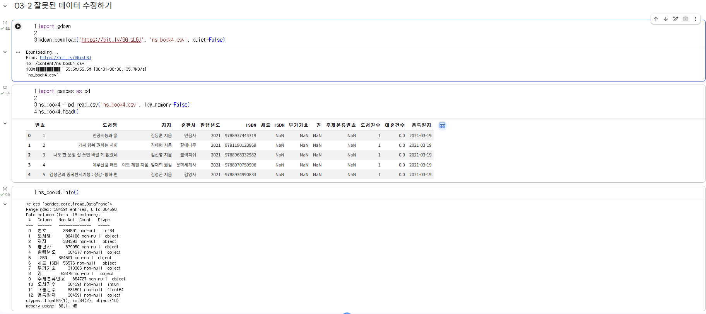
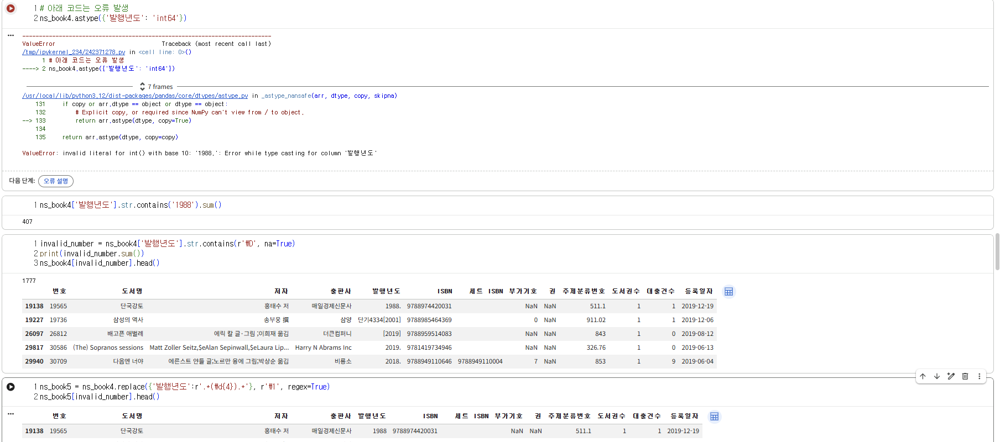
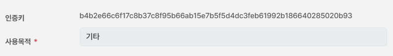

# 데이터분석 3주차 정규과제

📌데이터분석 정규과제는 매주 정해진 분량의 『*혼자 공부하는 데이터 분석 with 파이썬*』 을 읽고 학습하는 것입니다. 이번 주는 아래의 **DataAnalysis_3rd_TIL**에 나열된 분량을 읽고 공부하시면 됩니다.

아래의 문제를 풀어보며 학습 내용을 점검하세요. 문제를 해결하는 과정에서 개념을 스스로 정리하고, 필요한 경우 제시된 강의를 참고하여 보완하는 것이 좋습니다.

<!-- 강의 링크는 아래와 같습니다.
https://www.youtube.com/watch?v=CE3_InvbmLY&list=PLVsNizTWUw7FGzSRCkQrPEEe-ljVXgS7k&index=6
https://www.youtube.com/watch?v=hhbzUEQWdTg&list=PLVsNizTWUw7FGzSRCkQrPEEe-ljVXgS7k&index=7
-->


## DataAnalysis_3rd_TIL

### 3장 데이터 정제하기
#### 01. 불필요한 데이터 삭제하기
#### 02. 잘못된 데이터 수정하기


## Study Schedule

| 주차  | 공부 범위     | 완료 여부 |
| ----- | ------------- | --------- |
| 1주차 | p.24~81    | ✅         |
| 2주차 | p.84~151   | ✅         |
| 3주차 | p.154~219  | ✅         |
| 4주차 | p.222~279 | 🍽️         |
| 5주차 | p.282~325 | 🍽️         |
| 6주차 | p.328~379 | 🍽️         |
| 7주차 | p.382~430 | 🍽️         |

<br>

<!-- 여기까진 그대로 둬 주세요-->


# 1️⃣ 개념 정리 

## 01. 불필요한 데이터 삭제하기

핵심 개념 정리
데이터 정제는 데이터 분석 목적에 맞게 손상되거나 불필요한 값을 수정하고 삭제하는 필수 작업이다. 데이터 랭글링 또는 데이터 먼징이라고도 부른다.

행과 열 선택 및 필터링

- 슬라이싱: 대괄호 연산자에 시작과 끝 범위를 지정하여 원하는 행 구간을 잘라내어 선택하는 방법이다.
- 불리언 배열: 특정 조건에 따라 참과 거짓으로 이루어진 배열을 만드는 것입니다. 이를 대괄호 연산자에 넣으면 참으로 표시된 행만 필터링할 수 있다.
- loc 메서드: 불리언 배열을 전달하여 조건에 맞는 행을 추출할 때 사용합니다. 쉼표와 콜론 기호를 함께 써서 전체 열을 선택한다는 것을 명시적으로 표현할 수도 있다.

결측치 및 중복 데이터 처리

- dropna 메서드: 비어있는 값인 NaN이 포함된 불필요한 행이나 열을 찾아 삭제한다.
- duplicated 메서드: 데이터프레임 안에서 중복된 행을 찾아 불리언 배열로 반환한다.
- keep 매개변수: duplicated 메서드 안에서 False 값으로 지정하면, 처음 등장한 데이터인지 여부와 상관없이 중복된 모든 행을 일괄적으로 참으로 표시하여 빈틈없이 확인할 수 있게 해준다.


## 02. 잘못된 데이터 수정하기

- 누락된 값 확인: 판다스는 누락된 값을 기본적으로 NaN으로 표시한다. 데이터프레임에 누락된 값이 얼마나 있는지 정확히 파악하려면 isna 메서드를 사용한다.
- 개수 헤아리기: isna 메서드는 각 행의 값이 비어있는지를 참과 거짓의 불리언 배열로 반환한다. 여기에 sum 메서드를 연결하여 호출하면, 참으로 표시된 개수를 더해 비어있는 값의 총개수를 아주 쉽게 헤아릴 수 있다.
- 결측치 명시적 입력: 판다스에서 누락된 값을 명시적으로 입력할 때는 넘파이 패키지의 np.nan을 사용한다. 문자열 열에 None을 입력하면 결측치가 아닌 문자열 그대로 인식될 수 있으니 주의해야 한다.
- 누락된 값 일괄 변경: isna 메서드와 loc 메서드를 조합해 결측치를 바꿀 수도 있지만, fillna 메서드를 사용하면 데이터프레임 내의 모든 결측치를 원하는 값으로 한 번에 바꿀 수 있어 매우 편리하다.
- replace 메서드: 결측치뿐만 아니라 특정 값을 다른 값으로 유연하게 바꿀 수 있는 메서드다. 바꿀 값이 여러 개면 리스트로 묶어 전달하고, 열마다 다르게 적용하려면 딕셔너리 형태를 활용해 세밀하게 수정할 수 있다.

잘못된 값 및 이상치 수정 과정 
문자열 포함 여부 확인 -> 정규 표현식을 통한 정제 -> 안전한 데이터 타입 변환 -> 비교 연산을 통한 이상치 보정 -> 최종 데이터 보정

# 2️⃣ 수행 인증

<!-- 교재에서 안내된 과정을 직접 실행해본 뒤, 진행 결과가 보이도록 4~6장의 스크린샷을 캡처하여 아래에 첨부해주세요.-->
<!-- 이번 주차에는 API를 발급받는 과정도 포함하여 첨부해주세요.-->








<br>
<br>

# 3️⃣ 확인 문제

## 문제 1.

> **🧚Q. 다음 두 데이터프레임 df1, df2를 합쳐서 데이터프레임 df3를 만들려고 합니다.**  
> 적절한 판다스 명령을 선택해주세요.

<table>
<tr>

<td>

### df1

| index | col1 | col2 |
|-------|------|------|
| 0     | x    | 5    |
| 1     | y    | 6    |
| 2     | z    | 7    |

</td>

<td>

### df2

| index | col3 | col4 |
|-------|------|------|
| 0     | x    | 50   |
| 1     | y    | 60   |
| 2     | w    | 70   |

</td>

<td align="center" valign="middle">

<h2> ➜ </h2>

</td>

<td>

### df3 (결과)

| index | col1 | col2 | col3 | col4 |
|-------|------|------|------|------|
| 0     | x    | 5.0  | x    | 50.0 |
| 1     | y    | 6.0  | y    | 60.0 |
| 2     | z    | 7.0  | NaN  | NaN  |
| 3     | NaN  | NaN  | w    | 70.0 |

</td>

</tr>
</table>

```
1️⃣ pd.merge(df1, df2)
2️⃣ pd.merge(df1, df2, how='left')
3️⃣ pd.merge(df1, df2, left_on='col1', right_on='col3', how='outer')
4️⃣ pd.merge(df1, df2, left_on='col1', right_on='col3', how='inner')
```

```
정답은 3번이다.
col1이랑 col3을 기준으로 합쳤는데, 한쪽에만 있는 값(z, w)도 안 버리고 NaN으로 다 살려뒀으니 outer 방식으로 합친 것이다.
```


### 🎉 수고하셨습니다.