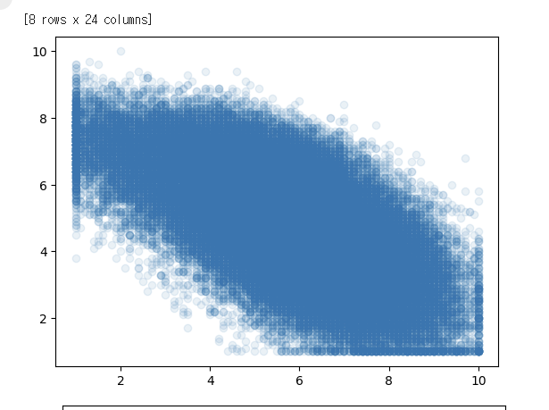
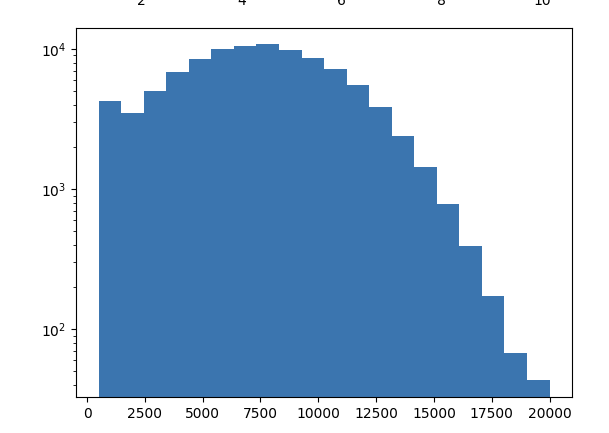
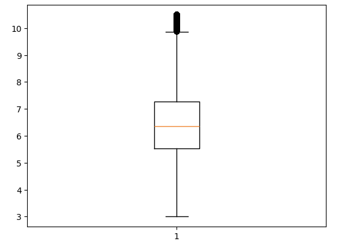
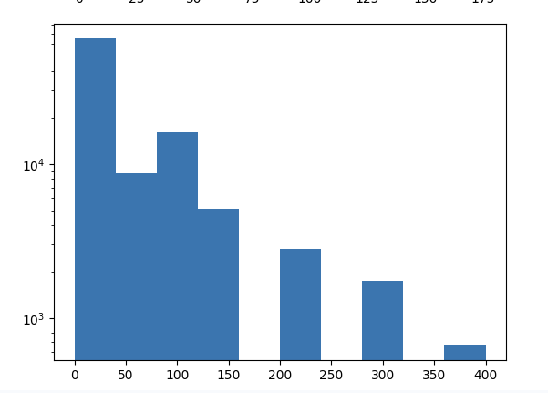

# 데이터분석 4주차 정규과제

📌데이터분석 정규과제는 매주 정해진 분량의 『*혼자 공부하는 데이터 분석 with 파이썬*』 을 읽고 학습하는 것입니다. 이번 주는 아래의 **DataAnalysis_4th_TIL**에 나열된 분량을 읽고 공부하시면 됩니다.

아래의 문제를 풀어보며 학습 내용을 점검하세요. 문제를 해결하는 과정에서 개념을 스스로 정리하고, 필요한 경우 제시된 강의를 참고하여 보완하는 것이 좋습니다.

<!-- 강의 링크는 아래와 같습니다.
https://www.youtube.com/watch?v=HNlRYQnLkek&list=PLVsNizTWUw7FGzSRCkQrPEEe-ljVXgS7k&index=8
https://www.youtube.com/watch?v=Cbk_tQtuhbM&list=PLVsNizTWUw7FGzSRCkQrPEEe-ljVXgS7k&index=9
-->


## DataAnalysis_4th_TIL

### 4장 데이터 요약하기
#### 01. 통계로 요약하기
#### 02. 분포 요약하기


## Study Schedule

| 주차  | 공부 범위     | 완료 여부 |
| ----- | ------------- | --------- |
| 1주차 | p.24~81    | ✅         |
| 2주차 | p.84~151   | ✅         |
| 3주차 | p.154~219  | ✅         |
| 4주차 | p.222~279 | ✅         |
| 5주차 | p.282~325 | 🍽️         |
| 6주차 | p.328~379 | 🍽️         |
| 7주차 | p.382~430 | 🍽️         |

<br>

<!-- 여기까진 그대로 둬 주세요-->


# 1️⃣ 개념 정리 

## 01. 통계로 요약하기

<!-- 새롭게 배운 내용을 자유롭게 정리해주세요.-->


기술통계와 EDA
- 기술통계(요약 통계): 복잡한 전체 데이터의 특징을 이해하기 쉽게 평균, 표준편차 같은 정량적 수치로 압축해서 설명하는 방법이다.
- 탐색적 데이터 분석(EDA): 이런 통계 수치와 데이터 시각화를 모두 아우르며 데이터의 특징을 탐색하는 분석 과정을 말한다.

마법의 메서드: describe()
- 판다스의 describe() 메서드를 사용하면 수치형 열에 대한 기본 요약 통계를 한 번에 쫙 뽑아볼 수 있다.
- 누락된 값을 제외한 데이터 개수(count), 평균(mean), 표준편차(std), 최솟값(min), 최댓값(max)을 알려준다.
- 추가로 데이터를 순서대로 늘어놓았을 때의 25%, 50%(중앙값), 75% 지점에 해당하는 값도 함께 계산해 준다.

통계 키워드
- 평균: 데이터 값을 모두 더한 후 개수로 나눈 가장 기본적인 통계량이다.
- 중앙값: 전체 데이터를 크기 순서대로 일렬로 나열했을 때 딱 중간에 위치한 값이다.
- 분위수: 순서대로 나열된 데이터를 4등분(사분위수)하거나 100등분(백분위수)하여 일정한 간격으로 나눈 기준점이다.
- 분산: 데이터가 평균에서 얼마나 멀리 퍼져 있는지를 알려주는 값이다.
- 표준편차: 분산의 제곱근이다. 분산과 마찬가지로 데이터의 퍼짐 정도를 나타내지만, 원본 데이터와 단위가 같아져서 해석하기가 훨씬 쉽다.
- 최빈값: 데이터에서 가장 많이 등장하는 값이다. 숫자뿐만 아니라 문자 데이터에도 쓸 수 있다.


## 02. 분포 요약하기

<!-- 새롭게 배운 내용을 자유롭게 정리해주세요.-->

1. 산점도 (Scatter Plot)
- 개념: 두 변수(특성) 간의 관계를 x축과 y축 좌표계를 이용해 점으로 흩뿌려 그리는 그래프다. 데이터가 어떤 상관관계(양의 상관관계, 음의 상관관계)를 가지는지 파악할 때 유용하다.
- 그리기: plt.scatter(x축_데이터, y축_데이터) 함수를 사용한다.
- 팁 (투명도 조절): 데이터가 너무 많아 점들이 새까맣게 뭉쳐 보일 때는 alpha 매개변수에 0~1 사이의 값을 넣어 투명도를 조절하면 밀집도를 쉽게 파악할 수 있다.

2. 히스토그램 (Histogram)
- 개념: 데이터 값을 일정한 구간(bin)으로 나누고, 그 구간 안에 포함된 데이터 개수(도수)를 막대 그래프로 표현한 것이다. 데이터가 어디에 집중적으로 분포하는지 한눈에 볼 수 있다.
- 그리기: plt.hist(데이터) 함수를 사용하며, 기본적으로 10개의 구간으로 나눈다. bins 매개변수로 구간 개수를 직접 지정할 수도 있다.

3. 로그 스케일 (Log Scale)
- 개념: 특정 구간의 데이터 쏠림 현상이 너무 심해서 다른 구간의 데이터가 아예 보이지 않을 때 사용하는 마법 같은 기능이다. y축 값에 로그 함수를 적용해 큰 값일수록 도수 크기를 확 줄여서 작은 값들과의 차이를 줄여준다.
- 적용: plt.yscale('log')처럼 축 스케일을 지정하는 함수에 'log'를 전달하면 숨겨져 있던 작은 구간의 데이터들도 그래프에 짠 하고 나타난다.


# 2️⃣ 수행 인증

<!-- 교재에서 안내된 과정을 직접 실행해본 뒤, 진행 결과가 보이도록 3장 이상의 스크린샷을 캡처하여 아래에 첨부해주세요.-->








<br>
<br>

# 3️⃣ 확인 문제

## 문제 1.

> **🧚Q. 이번 주차에는 확인문제 대신 실습 과제를 진행합니다. 캐글에서 원하는 데이터셋을 선택하여 기술통계를 계산하고, 다양한 시각화를 수행해보세요.
작업은 코랩에서 진행한 뒤, 코랩 링크를 아래에 첨부해주세요.**

```
https://colab.research.google.com/drive/1doZMWobPUH630F28QVijRtAp0iCTwOHZ?usp=sharing
```


### 🎉 수고하셨습니다.