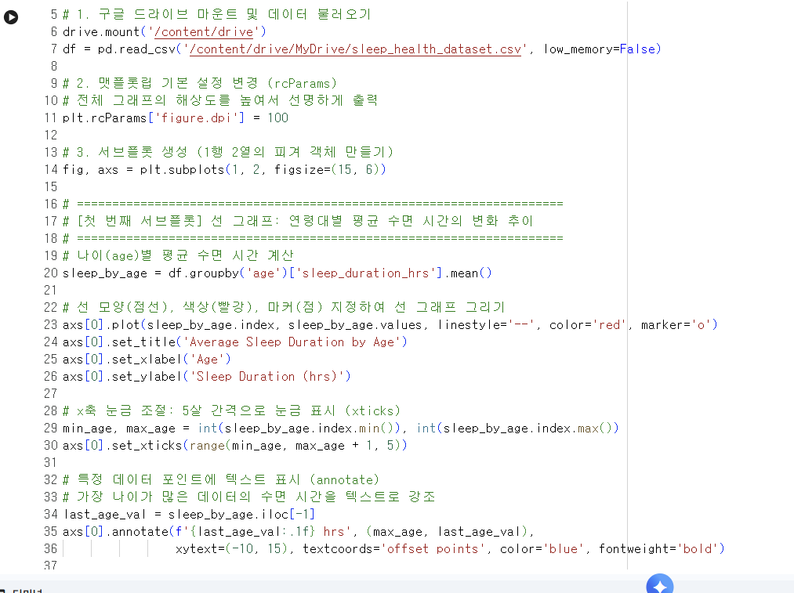
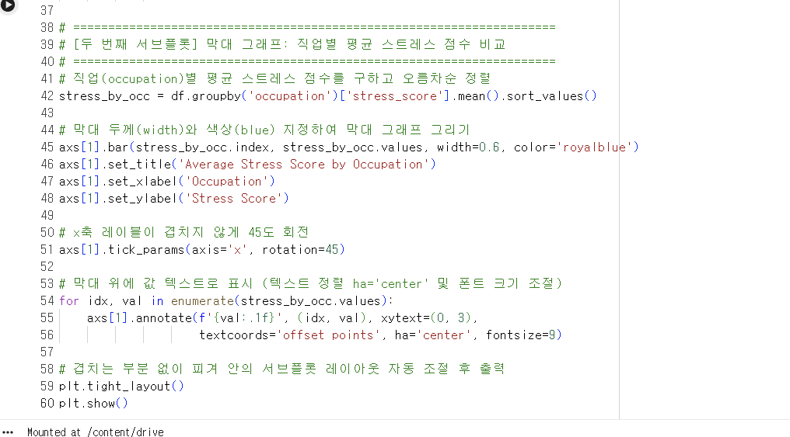
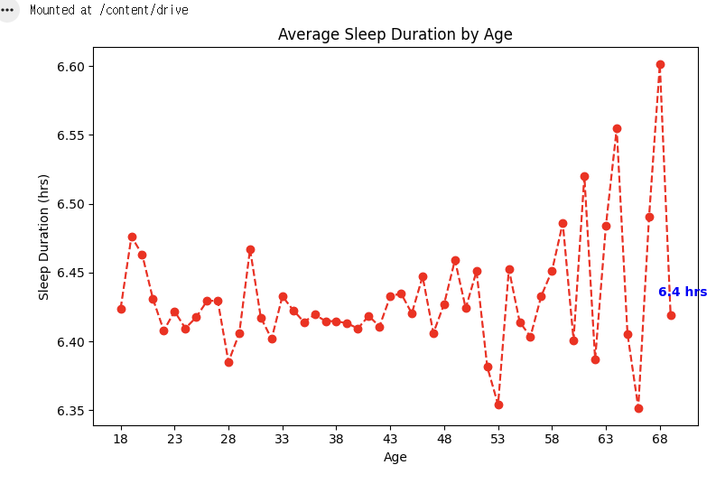
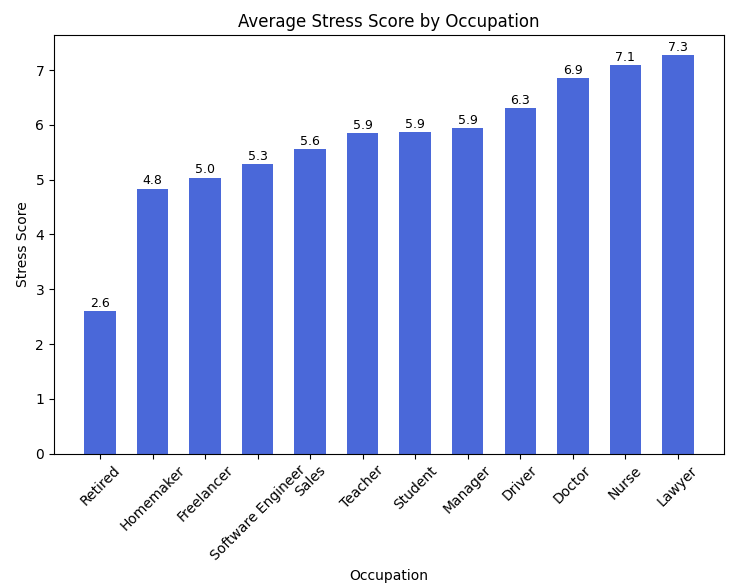

# 데이터분석 5주차 정규과제

📌데이터분석 정규과제는 매주 정해진 분량의 『*혼자 공부하는 데이터 분석 with 파이썬*』 을 읽고 학습하는 것입니다. 이번 주는 아래의 **DataAnalysis_5th_TIL**에 나열된 분량을 읽고 공부하시면 됩니다.

아래의 문제를 풀어보며 학습 내용을 점검하세요. 문제를 해결하는 과정에서 개념을 스스로 정리하고, 필요한 경우 제시된 강의를 참고하여 보완하는 것이 좋습니다.

<!-- 강의 링크는 아래와 같습니다.
https://www.youtube.com/watch?v=ho0LZ6GWhtc&list=PLVsNizTWUw7FGzSRCkQrPEEe-ljVXgS7k&index=10
https://www.youtube.com/watch?v=deYY4xHsI0o&list=PLVsNizTWUw7FGzSRCkQrPEEe-ljVXgS7k&index=11
-->


## DataAnalysis_5th_TIL

### 5장 데이터 시각화하기
#### 01. 맷플롯립 기본 요소 알아보기
#### 02. 선 그래프와 막대 그래프 그리기


## Study Schedule

| 주차  | 공부 범위     | 완료 여부 |
| ----- | ------------- | --------- |
| 1주차 | p.24~81    | ✅         |
| 2주차 | p.84~151   | ✅         |
| 3주차 | p.154~219  | ✅         |
| 4주차 | p.222~279 | ✅         |
| 5주차 | p.282~325 | ✅         |
| 6주차 | p.328~379 | 🍽️         |
| 7주차 | p.382~430 | 🍽️         |

<br>

<!-- 여기까진 그대로 둬 주세요-->


# 1️⃣ 개념 정리 

## 01. 맷플롯립 기본 요소 알아보기

<!-- 새롭게 배운 내용을 자유롭게 정리해주세요.-->
핵심 개념 정리
- figure: 그래프의 모든 시각적 요소를 담고 있는 가장 큰 바탕이자 최상위 도화지다. 그래프를 그릴 때 기본으로 자동 생성되지만, 직접 생성하면 전체 크기나 해상도 등 다양한 세부 옵션을 조절할 수 있다.
- 기본 설정 객체: 그래프를 그릴 때 적용되는 기본값을 전반적으로 관리한다. 여기서 해상도나 점의 모양 같은 설정을 한 번 바꿔두면, 이후에 그리는 모든 그래프에 바뀐 설정이 일괄적으로 적용되어 편리하다.
- 서브플롯: 하나의 큰 피겨 도화지 안에 담긴 개별 그래프 영역이다. 이 기능을 활용하면 한 화면에 산점도와 히스토그램 등 여러 종류의 그래프를 나란히 띄워 동시에 비교할 수 있다.
- 축과 레이블: 데이터의 좌표를 표현하는 기준선이 축이다. 축에는 값의 위치를 보여주는 눈금이 표시되며, 해당 축이 어떤 데이터를 의미하는지 알려주는 이름표인 레이블이 함께 붙는다.
- 마커: 산점도 같은 그래프에서 개별 데이터의 실제 위치를 화면에 콕 찍어 표시하는 기호다. 기본 모양은 동그라미지만, 설정을 통해 별 모양 등 원하는 형태로 자유롭게 바꿀 수 있다.

## 02. 선 그래프와 막대 그래프 그리기

<!-- 새롭게 배운 내용을 자유롭게 정리해주세요.-->
1. 선 그래프
- 개념: 데이터 포인트들을 선으로 쭉 이어서 그린 그래프다. 시간의 흐름에 따른 데이터의 추세나 변화(예: 연도별 도서 발행 건수)를 살펴볼 때 아주 유용하다.
- 그리기: plot 함수에 x축 값과 y축 값을 차례대로 전달해서 그린다.
- 스타일 꾸미기: 매개변수를 추가해 선의 모양(실선, 점선, 쇄선 등)이나 색상을 바꿀 수 있다. 또한 마커 옵션을 넣으면 데이터가 있는 위치에 기호를 찍어줘서 점의 위치를 훨씬 명확하게 보여줄 수 있다.

2. 막대 그래프
- 개념: 데이터의 크기를 막대의 높이로 나타낸 그래프다. x축에는 범주형 데이터(항목)를 두고, y축에는 그 크기나 개수를 표현하여 서로 비교할 때 주로 쓴다.
- 그리기: bar 함수를 사용하며, 기본적인 사용 방법은 선 그래프와 거의 똑같다. (가로로 긴 막대 그래프를 그리고 싶다면 barh 함수를 사용하면 된다.)
- 세부 조절: 매개변수를 이용해 막대의 두께를 얇게 하거나 색상을 원하는 대로 변경할 수 있다.

3. 그래프 디테일 살리기 (공통 옵션)
- 제목 및 이름표: 그래프 전체의 제목은 title, x축과 y축이 무엇을 의미하는지 나타내는 이름표는 각각 xlabel과 ylabel 함수로 달아준다.
- 눈금 조절: 축에 표시되는 눈금의 간격이나 개수를 보기 편하게 바꾸고 싶을 때는 xticks 또는 yticks 함수를 활용한다.
- 텍스트 추가: 그래프 안의 특정 데이터 위치에 직접 글자나 숫자를 적어 강조하고 싶다면 annotate 함수를 쓴다. 이때 글자의 크기를 줄이거나 텍스트가 막대의 정중앙에 오도록 정렬 위치를 세밀하게 조절할 수도 있다.

# 2️⃣ 수행 인증

<!-- 교재에서 안내된 과정을 직접 실행해본 뒤, 진행 결과가 보이도록 4~6장의 스크린샷을 캡처하여 아래에 첨부해주세요.-->









<br>
<br>

# 3️⃣ 확인 문제

## 문제 1.

> **🧚Q. 다음 데이터를 이용하여 matplotlib으로 선그래프를 그리는 코드를 작성해주세요.**
- x = [1, 2, 3, 4, 5]
- y = [2, 4, 6, 8, 10]
> 조건은 아래와 같습니다.
```
1️⃣ 제목은 "Linear Trend"로 설정해주세요.
2️⃣ x축 이름은 "X values"로 설정해주세요.
3️⃣ y축 이름은 "Y values"로 설정해주세요.
4️⃣ 마커(marker)를 포함하여 선그래프를 그려주세요.
```

```
import matplotlib.pyplot as plt

x = [1, 2, 3, 4, 5]
y = [2, 4, 6, 8, 10]

plt.plot(x, y, marker='o')

plt.title("Linear Trend")
plt.xlabel("X values")
plt.ylabel("Y values")

plt.show()
```


### 🎉 수고하셨습니다.