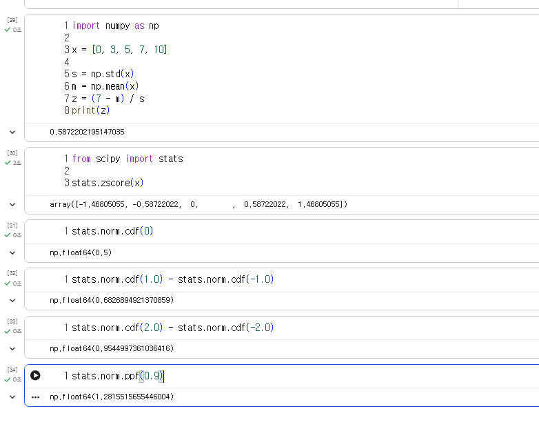
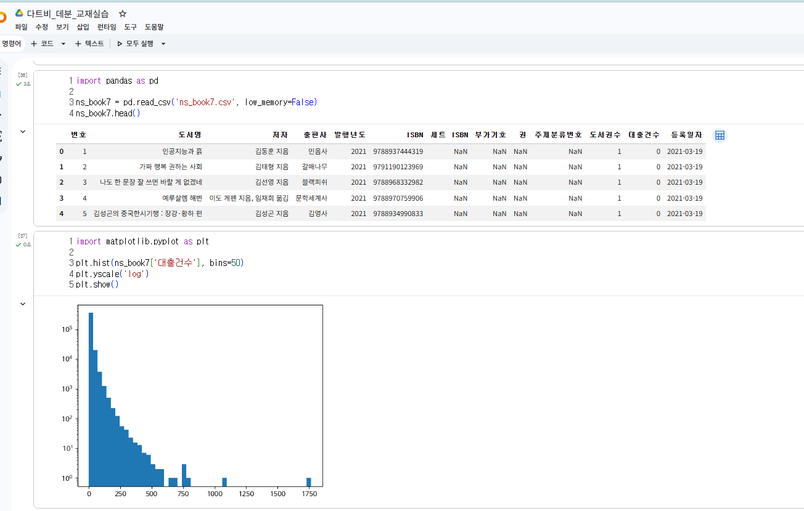
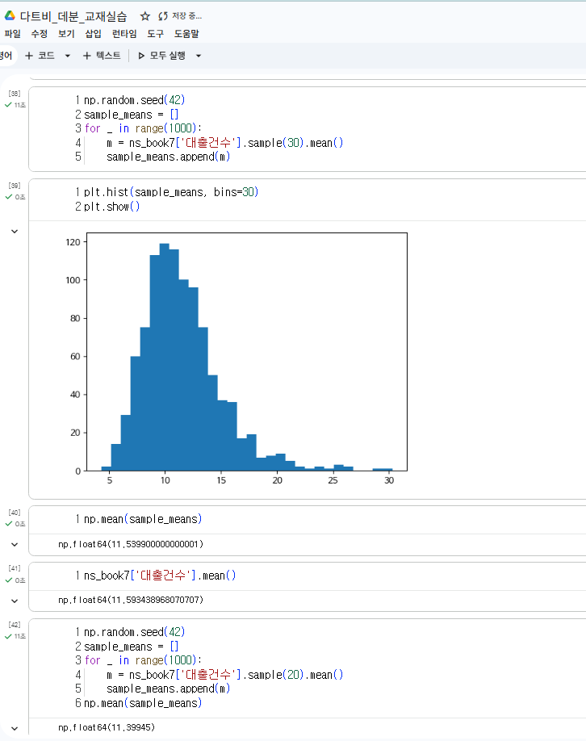
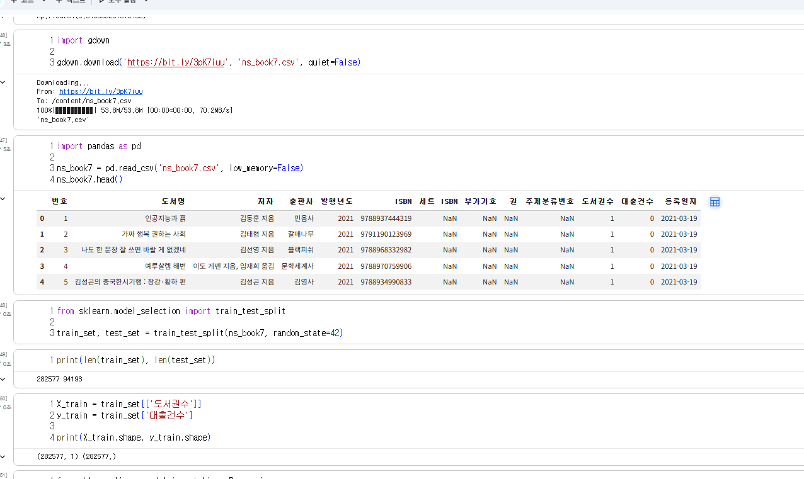
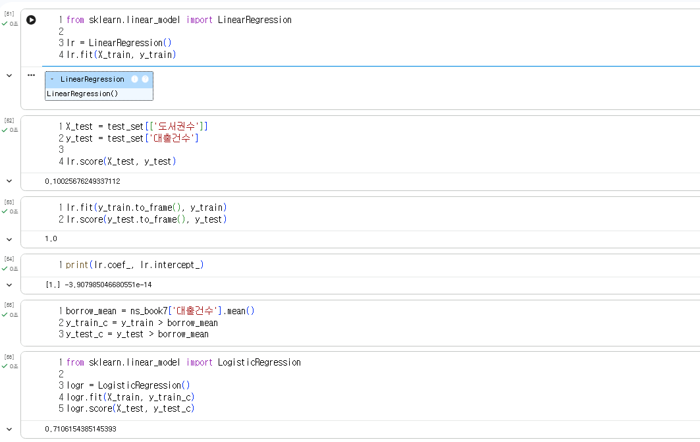
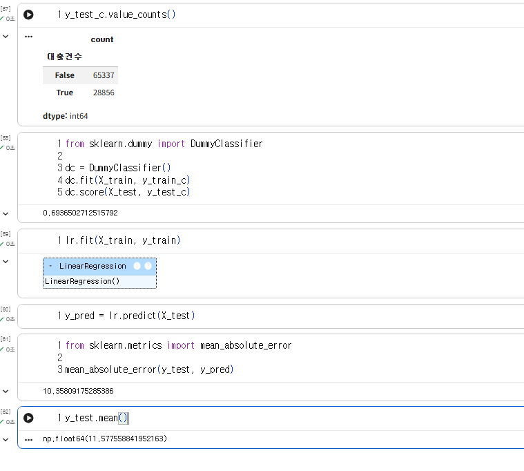

# 데이터분석 7주차 정규과제

📌데이터분석 정규과제는 매주 정해진 분량의 『*혼자 공부하는 데이터 분석 with 파이썬*』 을 읽고 학습하는 것입니다. 이번 주는 아래의 **DataAnalysis_7th_TIL**에 나열된 분량을 읽고 공부하시면 됩니다.

아래의 문제를 풀어보며 학습 내용을 점검하세요. 문제를 해결하는 과정에서 개념을 스스로 정리하고, 필요한 경우 제시된 강의를 참고하여 보완하는 것이 좋습니다.

<!-- 강의 링크는 아래와 같습니다.
https://www.youtube.com/watch?v=R3E4m8fqUSg&list=PLVsNizTWUw7FGzSRCkQrPEEe-ljVXgS7k&index=14
https://www.youtube.com/watch?v=W_cxRstQUk8&list=PLVsNizTWUw7FGzSRCkQrPEEe-ljVXgS7k&index=15
-->


## DataAnalysis_7th_TIL

### 7장 검증하고 예측하기
#### 01. 통계적으로 추론하기
#### 02. 머신러닝으로 예측하기


## Study Schedule

| 주차  | 공부 범위     | 완료 여부 |
| ----- | ------------- | --------- |
| 1주차 | p.24~81    | ✅         |
| 2주차 | p.84~151   | ✅         |
| 3주차 | p.154~219  | ✅         |
| 4주차 | p.222~279 | ✅         |
| 5주차 | p.282~325 | ✅         |
| 6주차 | p.328~379 | ✅         |
| 7주차 | p.382~430 | ✅         |

<br>

<!-- 여기까진 그대로 둬 주세요-->


# 1️⃣ 개념 정리 

## 01. 통계적으로 추론하기

모수검정: 일부 샘플을 통해 관심 대상인 전체 데이터, 즉 모집단의 평균이나 분산을 추정하여 가설을 테스트하는 방법이다.

표준점수: Z점수라고도 부르며 특정 데이터가 평균에서 얼마나 떨어져 있는지를 표준편차 비율로 나타낸 값이다. 몸무게와 키처럼 단위가 완전히 달라도 이 점수로 변환하면 서로 공평하게 잣대를 대고 비교할 수 있다.

중심극한정리: 원래 데이터가 어떤 분포를 가지든 상관없이, 무작위로 30개 이상의 샘플을 뽑아 평균을 구하는 작업을 무한히 반복하면 결국 그 평균들의 분포는 예쁜 종 모양의 정규분포에 가까워진다는 아주 중요한 이론이다.

신뢰구간: 알 수 없는 모집단의 진짜 평균이 이 안에 들어있을 것이라고 추정하는 범위다. 실무에서는 일반적으로 95퍼센트 확률로 믿을 수 있는 범위를 가장 널리 사용한다.

가설검정: 뽑아낸 샘플 데이터를 근거로 전체 집단에 대한 가설을 받아들일지 버릴지 결정하는 통계적 방법이다. 효과가 없다고 치부하는 영가설과 내가 진짜로 증명하고 싶은 대립가설을 세워두고 비교한다.

순열검정: 데이터가 정규분포를 따른다는 깐깐한 가정을 할 수 없을 때 쓰는 방법이다. 두 그룹의 데이터를 무작위로 마구 섞어서 다시 나누는 과정을 여러 번 반복해, 원래 발생했던 두 그룹 간의 차이가 우연인지 진짜 의미 있는 차이인지 검증한다.

## 02. 머신러닝으로 예측하기

머신러닝과 모델: 컴퓨터가 데이터 안에서 스스로 패턴을 찾아내어 학습하고 판단하는 기술이다. 이렇게 학습을 완료하여 새로운 데이터에 대한 예측을 수행할 수 있는 상태의 결과물을 '모델'이라고 부른다. 파이썬에서는 주로 '사이킷런' 패키지를 사용해 모델을 훈련시킨다.

지도 학습과 비지도 학습: 모델에 넣어주는 입력 데이터에 명확한 정답(타깃)이 있어서 그것을 맞추도록 훈련하는 것이 '지도 학습'이다. 반면 정답을 알려주지 않고 데이터 자체의 특징이나 비슷한 무리를 스스로 찾아내게 하는 것은 '비지도 학습'이다.

훈련 세트와 테스트 세트: 모델이 연습 문제의 정답을 그냥 달달 외우는 것을 방지하고 진짜 실력을 평가하기 위해, 전체 데이터를 학습용(훈련 세트)과 시험용(테스트 세트)으로 분리해서 사용한다. 특정 데이터가 몰리지 않게 무작위로 섞어서 나누는 것이 중요하다.

선형 회귀: 데이터의 전반적인 경향성을 가장 잘 설명하는 최적의 직선을 그어 미래의 값을 예측하는, 가장 기본적이고 널리 쓰이는 지도 학습 알고리즘이다.

결정계수: 훈련을 마친 회귀 모델이 얼마나 똑똑하게 타깃(정답)을 예측하는지 평가하는 점수다. 보통 0에서 1 사이의 값을 가지며, 1에 가까울수록 모델의 예측이 훌륭하다는 뜻이다.


# 2️⃣ 수행 인증

<!-- 교재에서 안내된 과정을 직접 실행해본 뒤, 진행 결과가 보이도록 4~6장의 스크린샷을 캡처하여 아래에 첨부해주세요.-->













<br>
<br>

# 3️⃣ 확인 문제

## 문제 1.

> **🧚Q. 어떤 표본의 크기가 충분히 크고(n ≥ 30), 모집단 분산을 알 수 없을 때 모평균에 대한 신뢰구간을 구하려고 한다.
이때 다음 설명 중 가장 적절한 것은 무엇인가?**

```
1️⃣ 표본의 크기가 충분히 크므로 중심극한정리에 의해 표본평균의 분포는 근사적으로 정규분포를 따른다.  
2️⃣ 모집단 분산을 모르므로 신뢰구간을 구할 수 없다.  
3️⃣ 표본이 30개 이상이면 항상 모집단도 정규분포를 따른다.  
4️⃣ 중심극한정리는 모집단이 정규분포일 때만 적용된다.
```

```
1️⃣
```

## 문제 2.

> **🧚Q. 다음 중 순열검정(permutation test)에 대한 설명으로 가장 옳은 것은 무엇인가?**

```
1️⃣ 모집단이 정규분포를 따른다는 가정을 반드시 해야 한다.  
2️⃣ 표준점수(z-score)를 이용하여 유의확률을 계산하는 방법이다.  
3️⃣ 데이터의 라벨을 무작위로 섞어 귀무가설 하에서의 분포를 직접 구성하는 비모수적 검정 방법이다.  
4️⃣ 표본의 크기가 충분히 클 때만 사용할 수 있다.
```

```
3️⃣
```


### 🎉 수고하셨습니다.